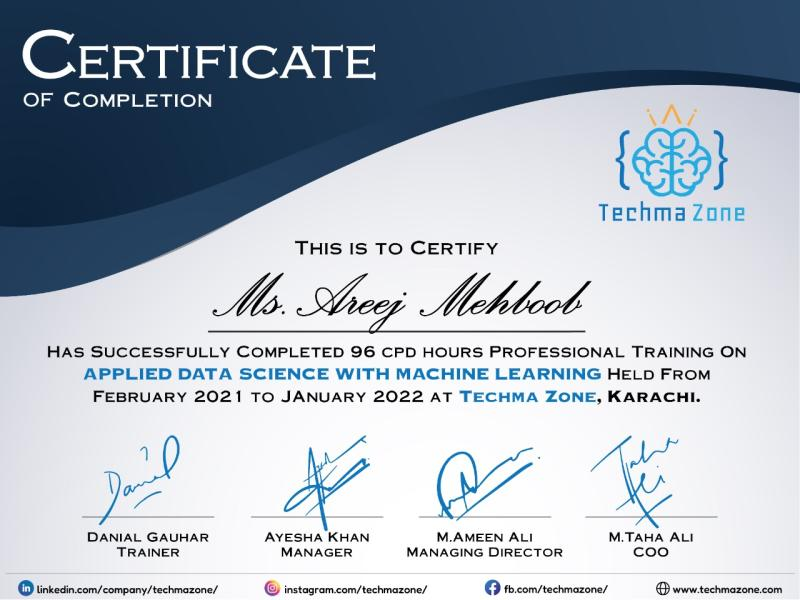
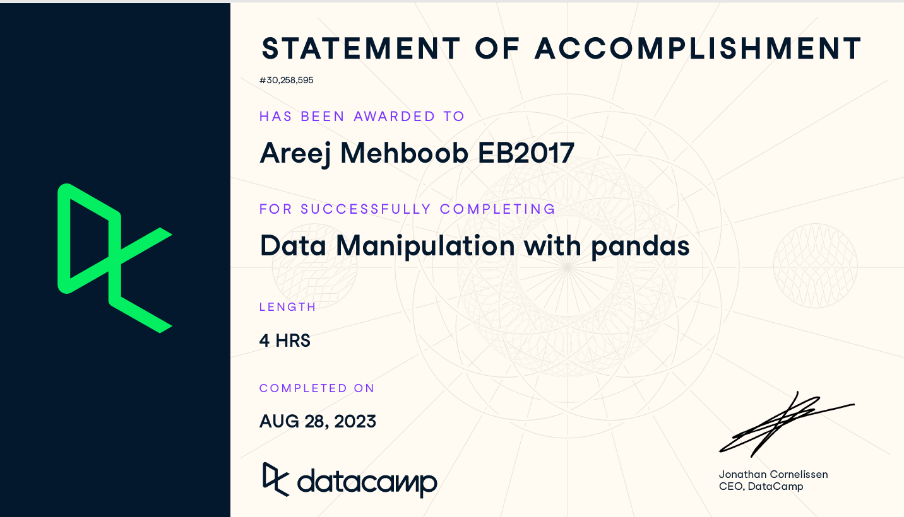
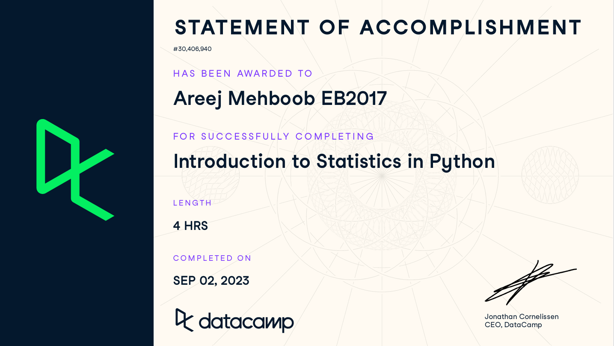

<!DOCTYPE html>
<html lang="en">
<head>
    <meta charset="UTF-8">
    <meta name="viewport" content="width=device-width, initial-scale=1.0">
    <title>Areej Mehboob - NLP Researcher</title>
    
</head>
<body>
    <!-- Header with Animated Name -->
    <section class="header">
        

            <h1 class="name-animation">Areej Mehboob</h1>
            

                NLP Researcher | LLMs | Retrieval Systems
            

            

                <a href="mailto:mehboobareej01@gmail.com" class="contact-link-header">
                    ✉️ mehboobareej01@gmail.com
                </a>
                <a href="https://www.linkedin.com/in/areej-mehboob-396b7a207/" class="contact-link-header" target="_blank">
                    🔗 LinkedIn
                </a>
                <a href="https://github.com/Areej17-01" class="contact-link-header" target="_blank">
                    💻 GitHub
                </a>
                <a href="https://huggingface.co/spaces/AreejMehboob17" class="contact-link-header" target="_blank">
                    🤗 Hugging Face
                </a>
            

            
            <!-- Buttons Container -->
            

                <a href="https://drive.google.com/uc?export=download&id=16Ma9jEKdb_2ONF6Oz1RE-W1Z5naS0SYQ" 
                   class="cv-button-header" 
                   download="Areej_Mehboob_CV.pdf">
                    ⬇️ Download CV
                </a>
                <a href="mailto:mehboobareej01@gmail.com" class="contact-button-header">
                    ✉️ Contact Me
                </a>
            

        

    </section>

    <!-- About Section -->
    <section class="about-section">
        

            <h2 class="collab-text">🤝 Open to Collaboration</h2>
            
💡 "The best way to predict the future is to create it." - Alan Kay

            

                
            

        

        

            <h2>👩‍💻 About Me</h2>
            
I'm an <strong>NLP researcher</strong> with a background in machine learning engineering and a BSCS in Computer Science, currently focused on advancing Retrieval-Augmented Generation (RAG) systems, AI agents, and large language models (both traditional and multimodal).

            
My work combines research and application development, building sophisticated retrieval engines, agentic RAG architectures, and autonomous AI agents while also creating practical applications. I have extensive hands-on experience in agent systems development and expertise in LLM evaluation methodologies and fine-tuning.

        

    </section>

    <!-- Skills Moving Belt -->
    <section class="skills-belt">
        <h2>🔥 Core Expertise</h2>
        

            
🤖 RAG Systems

            
🧠 AI Agents

            
📊 LLMs

            
🔍 Multimodal AI

            
⚡ Vector Databases

            
🚀 Retrieval Engines

            
🎯 LLM Evaluation

            
🔧 Fine-tuning

        

    </section>

    <!-- Education -->
    <section class="table-section">
        <h2>🎓 Education</h2>
        <table>
            <thead>
                <tr>
                    <th>Institution</th>
                    <th>Degree</th>
                    <th>Location</th>
                    <th>Duration</th>
                </tr>
            </thead>
            <tbody>
                <tr>
                    <td>University of Karachi</td>
                    <td>BSCS</td>
                    <td>Karachi, Pakistan</td>
                    <td>January 2020 – January 2024</td>
                </tr>
                <tr>
                    <td>Techmazone</td>
                    <td>Applied Data Science with Machine Learning</td>
                    <td>Karachi, Pakistan</td>
                    <td>February 2021 – January 2022</td>
                </tr>
            </tbody>
        </table>
    </section>

    <!-- Work Experience -->
    <section class="table-section">
        <h2>💼 Work Experience</h2>
        <table>
            <thead>
                <tr>
                    <th>Position</th>
                    <th>Company</th>
                    <th>Location</th>
                    <th>Duration</th>
                    <th>Description</th>
                </tr>
            </thead>
            <tbody>
                <tr>
                    <td>🔬 NLP Researcher</td>
                    <td>Traversaal.ai</td>
                    <td>California, USA (Remote)</td>
                    <td>October 2024 – Present</td>
                    <td>Working with evals, LLMs, Agents, and advanced retrieval systems</td>
                </tr>
                <tr>
                    <td>⚙️ ML Engineer</td>
                    <td>KDYS LAB (Pvt) Ltd</td>
                    <td>Karachi, Pakistan (Onsite)</td>
                    <td>March 2024 – October 2024</td>
                    <td>Worked on Agentic RAG with LangChain and LLM prompt wrapper APIs</td>
                </tr>
            </tbody>
        </table>
    </section>
    
    <!-- Featured Projects -->
   <!-- Projects Section -->
<!-- Projects Section -->
<section class="projects">
    <h2>🚀 Featured Projects</h2>
    

        

            <h3>🤖 MultiAgenticSystem-crewAI</h3>
            
A sophisticated multi-agent system ,designed to perform automated tasks efficiently across various domains. Each agent operates independently, focusing on tasks like internet search, image classification, and retrieval-augmented generation (RAG) based queries.

            

                Python
                CrewAI
                LangChain
            

            <a href="https://github.com/Areej17-01/MultiAgenticSystem-crewAI-" class="project-link" target="_blank">View Project</a>
        

        

            <h3>❓Vision-Text RAG System</h3>
            
A comprehensive multimodal RAG architecture designed for processing images and text from pdf, Allowing user to talk with their pdf text and image content

            

                Python
                Transformer
                qdrant DB
            

            <a href="https://huggingface.co/spaces/AreejMehboob17/VisionText-RAG" class="project-link" target="_blank">View Project</a>
        

        

            <h3>🧠 Luminafi</h3>
            
AI-Powered Finance Analysis Workflow: Comprehensive financial analysis with real-time data, AI insights, and news updates

            

                Python
                PyTorch
                Transformers
            

            <a href="https://huggingface.co/spaces/AreejMehboob17/LuminaFi" class="project-link" target="_blank">View Project</a>
        

        

            <h3>🎭 LLMIND ARENA</h3>
            
An immersive AI experience powered by multiple LLMs, combining emotionally rich family drama roleplay and intelligent debate simulation—each character driven by a distinct language model for dynamic, realistic interactions.

            

                Python
                LLMs
                Transformers
            

            <a href="https://huggingface.co/spaces/AreejMehboob17/LLMindArena" class="project-link" target="_blank">View Project</a>
        

    

</section>

    <!-- Interactive Articles Section -->
    <section class="articles-section">
        <h2>📝 Articles & Blog Posts</h2>
        

            

                
🤖

                
Enabling Agentic AI Through the Model Context Protocol (MCP)

                
📋 Notion

                
Exploring how MCP enables seamless AI agent integration and communication across different platforms and systems.

                <a href="https://www.notion.so/traversaal-ai/Enabling-Agentic-AI-Through-the-Model-Context-Protocol-MCP-1b59a2e5c4a6803b9df2fb9928944831" target="_blank" class="article-link">Read Article</a>
            

            

                
🔍

                
Multi-Modal Enterprise RAG Architecture from Scratch

                
📝 Medium

                
A comprehensive guide to building scalable multimodal RAG systems for enterprise applications with advanced retrieval mechanisms.

                <a href="https://ai.gopubby.com/multi-modal-enterprise-rag-architecture-from-scratch-a3a12df0d055" target="_blank" class="article-link">Read Article</a>
            

            

                
⚡

                
Initialization of Weights in Neural Networks

                
📝 Medium

                
Deep dive into weight initialization techniques and their impact on neural network training performance and convergence.

                <a href="https://medium.com/@mehboobareej01/initialization-of-weights-in-neural-network-7243898988de" target="_blank" class="article-link">Read Article</a>
            

            

                
📊

                
Understanding TF-IDF: Formulas and sklearn Implementation

                
📝 Medium

                
Complete explanation of TF-IDF algorithm with mathematical formulas and practical implementation using scikit-learn.

                <a href="https://medium.com/@mehboobareej01/understanding-tf-idf-formulas-and-value-returned-output-from-sklearn-library-483cb2b02efa" target="_blank" class="article-link">Read Article</a>
            

            

                
🖼️

                
Feature Extraction Essentials for Image Similarity

                
📝 Medium

                
Comprehensive guide to feature extraction techniques for enhancing image similarity detection and computer vision applications.

                <a href="https://medium.com/@mehboobareej01/feature-extraction-essentials-enhancing-image-similarity-with-feature-extraction-f46473869d3a" target="_blank" class="article-link">Read Article</a>
            

        

    </section>

    <!-- Certifications Moving Belt -->
    <section class="cert-belt">
        <h2>🏆 Certifications</h2>
        

            

                
                <h4>Applied Data Science with ML</h4>
                
Techmazone

                
2021-2022 (96 CPD Hours)

            

            

                
                <h4>Applied Data Science with ML</h4>
                
Techmazone

                
2021-2022 (96 CPD Hours)

            

            

                
                <h4>Machine Learning Associate Intended</h4>
                
Jan 15, 2025 (23 Minutes)

            

            

                
                <h4>Data Manipulation With Panda</h4>
                
Aug, 2023 (4 hours)

            

            

                
                <h4>Introduction to Statistics In Python</h4>
                
Sep, 2023 (4 hours)

            

            

                
                <h4>Joining Data With Pandas</h4>
                
Sep, 2023 (4 hours)

            

    </section>

    <!-- Skills and Technology -->
    <section class="skills-tech">
        <h2>🛠️ Skills & Technologies</h2>
        

            

                <h3>🧠 AI/ML</h3>
                

                    Python
                    PyTorch
                    TensorFlow
                    🤗 Hugging Face
                    🦜 LangChain
                     llamaIndex
                     MCP
                     CrewAI
                

            

            

                <h3>🤖 Specializations</h3>
                

                    RAG Systems
                    AI Agents
                    LLMs
                    Multimodal AI
                    Vector DBs
                

            

            

                <h3>🔧 Tools</h3>
                

                    FastAPI
                    Docker
                    PostgreSQL
                    Git
                    Hugging Face deployment
                

            

        

    </section>
    <!-- Contact -->
    <section class="contact">
        <h2>🔗 Let's Connect</h2>
        

            <a href="https://huggingface.co/spaces/AreejMehboob17" class="contact-link" target="_blank">
                🤗 Hugging face
            </a>
            <a href="https://www.linkedin.com/in/areej-mehboob-396b7a207/" class="contact-link" target="_blank">
                💼 LinkedIn
            </a>
            <a href="mailto:mehboobareej01@gmail.com" class="contact-link">
                📧 Email
            </a>
            <a href="https://medium.com/@mehboobareej01" class="contact-link" target="_blank">
                📝 Medium
            </a>
        

    </section>

    <!-- Footer -->
    <footer class="footer">
        <h3>🙏 Thanks for visiting! Let's build together! 🚀</h3>
        
© 2024 Areej Mehboob. All rights reserved.

    </footer>
</footer>

    
</body>
</html>

   
